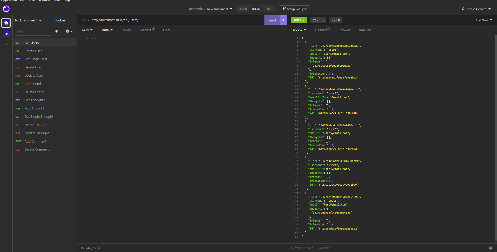

# social-network-api

## Description

This is a tool or interface that enables developers to access certain features and functionalities of a social networking platform. With this API, users can perform various actions such as sharing their own thoughts, reacting to the thoughts of their friends, and creating a list of friends on the network.

## Table of Contents

- [Installation](#installation)
- [Usage](#usage)
- [Link](#link)
- [Walkthrough](#walkthrough)
- [Screenshots](#screenshots)
- [License](#license)
- [Tests](#tests)

## Installation

To get started, you need to make a copy of the repository from Github onto your local machine. Once you have done that, open up your command line and navigate to the main folder where you have stored the repository files. From there, you need to run the command "npm install" which will download and install all the necessary dependencies required for the project to run smoothly.

## Usage

After installing all the necessary dependencies, you can launch the application by running either "npm start" or "node index.js" command in the main folder of the project. Once the application is up and running, you can start accessing various routes for users and thoughts. These routes allow you to perform different actions such as retrieving data (GET), adding new data (POST), updating existing data (PUT), and deleting data (DELETE) for both user and thought models.

## Link

[Repository](https://github.com/Tochio12/social-network-api)

## Walkthrough

[Walkthrough Video](https://drive.google.com/file/d/1lXjam_bVbzpWnn6cdmor9Byo4YLE2XuD/view)

## Screenshots

## License

This application is covered under the [MIT License](https://choosealicense.com/licenses/mit) license.

## Tests

You need to test all the routes available in the application to ensure that they are working correctly and returning the expected values. This means that you should test the GET route to retrieve data, the POST route to create new data, the PUT route to update existing data, and the DELETE route to remove data. By testing all the routes, you can make sure that your application is functioning properly and is able to handle user requests as expected.